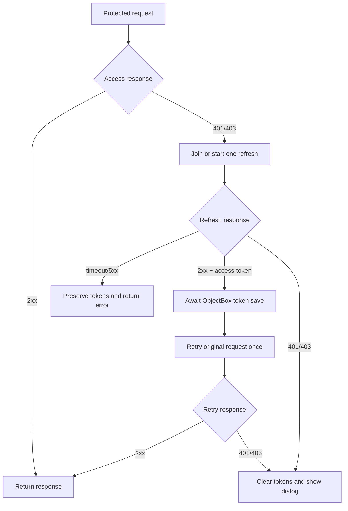

# TimelyFrontEnd integration

## Responsibilities

| Component | Responsibility |
| --- | --- |
| Session API | Issues access/refresh tokens, validates access, rotates or rejects refresh tokens. |
| `refresh_interceptor` | Adds auth header, coordinates refresh, saves tokens, retries, emits expiry. |
| Timely data layer | Implements Retrofit services and ObjectBox token storage. |
| Timely DI layer | Creates separate auth/app Dio clients and one shared interceptor. |
| Timely presentation | Registers `SessionExpiredDialog` and root navigator key. |

## Authentication flow



## Dependencies

During local package development, both `di` and `presentation` must point to
the same local package source:

```yaml
refresh_interceptor:
  path: "../../../personal projects/refresh_interceptor"
```

After publishing version 0.2.1, use `refresh_interceptor: ^0.2.1` in both
packages.

## Application bootstrap

`presentation/lib/main.dart` initializes UI before Injectable creates the
interceptor:

```dart
WidgetsFlutterBinding.ensureInitialized();

await RefreshInit.instance.initialize(
  sessionExpiredWidget: const SessionExpiredDialog(),
);

await initDI(get: GetIt.instance);
```

The root navigator uses:

```dart
GetMaterialApp(
  navigatorKey: RefreshInit.instance.navigatorKey,
  // ...
)
```

On anonymous first launch, Timely checks ObjectBox before calling `/profile/`.
No access token means LoginPage opens without a protected request or expiry
dialog.

## Injectable networking graph

`authDio` handles login and refresh without the interceptor. `appDio` handles
protected endpoints and receives the shared interceptor.

```dart
@Named('authDio')
@lazySingleton
Dio authDio() => Dio(baseOptions);

@lazySingleton
RefreshInterceptor refreshInterceptor(
  AuthLocalSource local,
  AuthApiService authApi,
) => RefreshInterceptor(
  tokenStore: TokenStoreAdapter(
    readAccessToken: local.getAccessToken,
    readRefreshToken: local.getRefreshToken,
    saveTokens: (accessToken, refreshToken) {
      if (refreshToken == null || refreshToken.isEmpty) {
        return local.insertAccessToken(accessToken);
      }
      return local.insertTokens(accessToken, refreshToken);
    },
    clearTokens: local.deleteTokens,
  ),
  onRefresh: (token) async {
    final response = await authApi.refresh({'refresh_token': token});
    return RefreshTokens(
      accessToken: response.accessToken!,
      refreshToken: response.refreshToken,
    );
  },
  shouldRefresh: (error) {
    final status = error.response?.statusCode;
    return status == 401 || status == 403;
  },
  rejectIfTokenMissing: true,
);

@Named('appDio')
@lazySingleton
Dio appDio(RefreshInterceptor refresh) {
  final dio = Dio(baseOptions);
  refresh.attachToAll([dio]);
  return dio;
}
```

Actual Timely storage uses ObjectBox record ID `1`. Every asynchronous write
must be awaited before retrying.

## Regenerate DI

After editing `DataModule` or `DomainModule`:

```sh
cd di
dart run build_runner build
```

Generated registrations live in `di/lib/injector.config.dart`.

## Run against Session API

From `presentation`:

```sh
flutter run --dart-define=API_BASE_URL=http://127.0.0.1:8000
```

Host selection:

| Target | API host |
| --- | --- |
| iOS Simulator | `127.0.0.1` |
| Android emulator | `10.0.2.2` |
| Physical Android/iPhone | Mac LAN address, for example `192.168.88.25` |

Physical device and Mac must share a network. The server must bind to
`0.0.0.0`, and the OS firewall must allow its port.

## Test scenarios

### Successful refresh

1. Store expired access token and valid refresh token.
2. Call `/profile/`.
3. Confirm one 401 from profile.
4. Confirm one `/refresh/` request.
5. Confirm tokens are updated.
6. Confirm profile retries once and succeeds.
7. Confirm no expiry dialog appears.

### Permanent expiry

1. Store expired access and expired/revoked refresh tokens.
2. Call `/profile/`.
3. Confirm profile and refresh both return 401/403.
4. Confirm ObjectBox tokens are removed.
5. Confirm exactly one `SessionExpiredDialog` appears.

### Anonymous startup

1. Clear ObjectBox tokens.
2. Restart app completely.
3. Confirm LoginPage appears.
4. Confirm `/profile/` is not requested.
5. Confirm no expiry dialog appears.

### Concurrent failures

1. Trigger several protected requests with expired access token.
2. Confirm only one refresh HTTP request occurs.
3. Confirm each original request retries at most once.

## Troubleshooting

| Symptom | Check |
| --- | --- |
| Connection refused on physical phone | Do not use `127.0.0.1`; use Mac LAN IP. |
| Profile retries with old token | Await ObjectBox `putAsync` and token adapter save. |
| Refresh 401 does not show dialog | Use package 0.2.1 and ensure 401/403 matches `shouldRefresh`. |
| Dialog appears on first launch | Skip profile without access token; keep `expireSessionOnMissingToken: false`. |
| Duplicate `GlobalKey<FormState>` | Do not keep one GetX login controller across overlapping LoginPage routes. |
| Endless refresh loop | Keep auth Dio separate and never attach interceptor to it. |
| 404 logs user out | Do not include 404 in `shouldRefresh`; fix route/API contract. |
| CocoaPods rejects ObjectBox | Set iOS deployment target to at least 15.0 for ObjectBox 5.3. |

## Verification commands

```sh
cd /path/to/refresh_interceptor
flutter test
flutter analyze

cd /path/to/TimelyFrontEnd/di
flutter analyze lib

cd /path/to/TimelyFrontEnd/presentation
flutter analyze lib/main.dart
```
